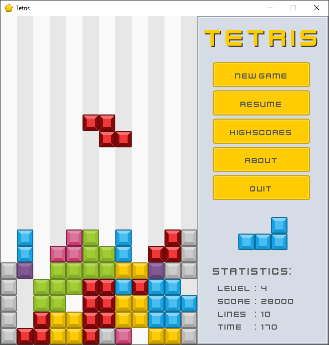

# About
A Tetris clone written in C++ using the SFML framework. 

# Download
You can download a build of the game from [Google Drive](https://drive.google.com/file/d/1A8ggqf1253U-Wf5znWyc8P1MA1kk2mxu/view). You will need Windows 7 or newer to run the game.

# How To Build The Game
* Download the [SFML 2.5.1](https://www.sfml-dev.org/download/sfml/2.5.1/) binaries and unzip them in the **third_party** folder.
* Download the [TGUI 0.8.3](https://github.com/texus/TGUI/releases) binaries and unzip them in the **third_party** folder.
* Open the project in **Visual Studio 2017**.
* Build and run the game.

**The binaries you download *must* be for the *Visual C++ 15 (2017) - 32-bit* compiler. If you want to use a different compiler you'll need to build SFML and TGUI from the source code.**